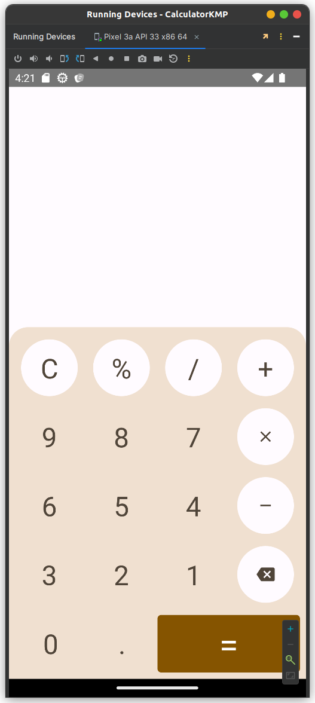
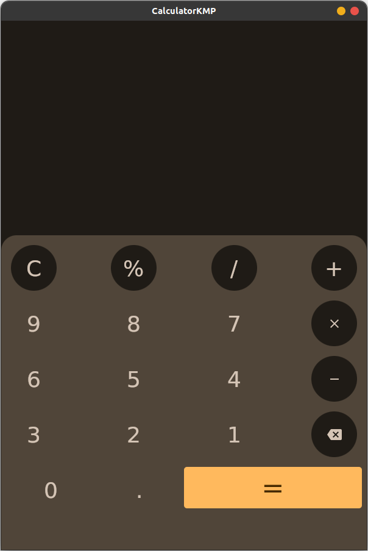

# CalculatorKMP

CalculatorKMP is a sample calculator app built using Compose Multiplatform, designed to run on both Android and Desktop platforms. 
It showcases the power of Kotlin Multiplatform (KMP) and Jetpack Compose in creating a consistent user experience across multiple platforms.

## Features

- Basic arithmetic operations: addition, subtraction, multiplication, division.
- Modern and intuitive user interface using Jetpack Compose.
- Consistent user experience on Android and Desktop platforms.
- Responsive layout that adapts to different screen sizes.

## Screenshots

| Android                         | Desktop                         |
|---------------------------------|---------------------------------|
|  |  |

## Getting Started

Follow these instructions to set up and run CalculatorKMP on your development machine.

### Prerequisites

* Android Studio / IntelliJ IDEA
* Kotlin 1.9.0 or later
* JDK 11 or later

### Steps

1. Clone the repository
    ```bash
   git clone https://github.com/rutubishi/kotlin-multiplatform-samples && cd CalculatorKMP
    ```
2. Open the project in Android Studio or IntelliJ IDEA.
3. Build and run the app on Android:

    - Open the androidApp module.
    - Run the app on an Android emulator or physical device.
    
4. Build and run the app on Desktop:

    - Open the desktopApp module.
    - Run the app on your desktop machine.

## Architecture

CalculatorKMP follows a modular architecture to achieve code sharing and separation of concerns.

* `common`: Shared Kotlin module containing core calculator logic.
* `androidApp`: Android-specific module for UI implementation and integration.
* `desktopApp`: Desktop-specific module for UI implementation and integration.

## Technologies Used
* **Kotlin Multiplatform**: Share code between Android and Desktop platforms.
* **Jetpack Compose**: Declarative UI framework for building modern UIs.
* **Gradle**: Build system for managing dependencies and building the project.
* **Git**: Version control system for collaborative development.

## Contributing
Contributions are welcome! If you find any bugs or want to add new features, feel free to create an issue or submit a pull request.

## License

CalculatorKMP is released under the [MIT License](LICENSE).

